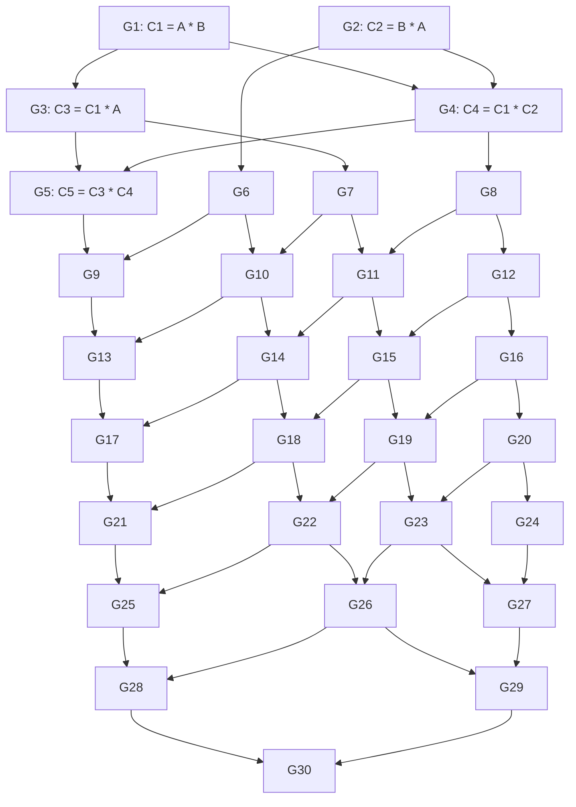

# A CUDA Graph of 30 GEMMs

`gemm_dag.cu` is a standalone learning example. It runs 30 dense matrix
multiplications once and checks every result against a CPU calculation. There
is no timing in this correctness executable, and no dependency on the main
project's build. The companion [performance test](BENCHMARK.md) measures repeated
execution using the repository's benchmark library.

All matrices are `64 x 64`, row-major, and use `float`. Here GEMM means the simple
operation `C = A * B`, without transpose, alpha, or beta parameters.
The inputs have positive entries and each row sums to 1, keeping repeated
products well scaled. They are mixed with the identity matrix to preserve
variation deeper into the graph.

## The dependency graph



An arrow means the producer must finish before the consumer can start. G1 and G2
have no prerequisites. G3 waits for G1, G4 waits for both G1 and G2, and G5 waits
for both G3 and G4. The later nodes keep branching and joining until G30 combines
G28 and G29. Every node contributes to the final output C30. Independent nodes
may overlap; overlap is not guaranteed.

The first five operations retain the original example's structure. G6 through
G12 widen the graph, G13 through G24 form three groups of four operations, and
G25 through G30 merge the remaining branches. Each `add_gemm` call in the source
lists its input/output buffers, prerequisites, and matrix equation in a comment.
These shared functions now live in `gemm_dag.cuh`, used by both executables.

Each node writes its own output buffer. Passing that buffer to a later node does
**not** tell CUDA about the dependency: the `{g1}`, `{g1, g2}`, and `{g3, g4}`
arguments explicitly provide the ordering.

## Build and run on Fir

From the repository root, load CUDA and compile:

```bash
module load StdEnv/2023 cuda/12.6
nvcc -std=c++17 -O2 -arch=sm_90 tests/cuda_graph/gemm_dag.cu -o tests/cuda_graph/gemm_dag
```

`sm_90` targets Hopper GPUs. Compilation can happen on the login node, but run
the executable inside a GPU allocation. For example:

```bash
salloc --gpus=h100:1 --cpus-per-task=1 --mem=2G --time=00:05:00
srun ./tests/cuda_graph/gemm_dag
exit  # Release the interactive allocation when finished.
```

If you already have a GPU allocation, just run the `srun` command there. A
successful run prints `PASS` for G1 through G30 and exits with status 0; a CUDA
error or a failed comparison exits with a nonzero status.

### Submit a batch job

From the repository root, submit the included script:

```bash
sbatch tests/cuda_graph/run.sbatch
```

The script requests one H100 GPU (`--gpus=h100:1`), one CPU, 2 GB of host memory,
and five minutes. Fir requires an explicit GPU type in GPU requests.
It loads CUDA, compiles into the job's temporary directory (`SLURM_TMPDIR`),
and runs the correctness check once. Both standard output and errors go to
`tests/cuda_graph/gemm-dag-<job-id>.out`. Look for `PASS` for G1 through G30.

## Reading the code

1. `gemm`: one GPU thread computes one output element using a dot product.
   Blocks contain `16 x 16` threads; a boundary check handles partial blocks.
2. `add_gemm`: packages the kernel, grid/block dimensions, argument values, and
   prerequisite nodes into `cudaGraphAddKernelNode`. It only builds a description.
3. `main`: allocates buffers, copies inputs, and calls `build_graph` in
   `gemm_dag.cuh`, which adds the 30 nodes explicitly.
4. `cudaGraphInstantiate`: prepares an executable version of the graph.
5. `cudaGraphLaunch`: submits the entire DAG. `cudaStreamSynchronize` waits for
   its completion before results are copied back and checked.

Allocation and CPU/GPU copies are outside the graph to keep the graph focused on
GEMM dependencies. This is a basic global-memory kernel without shared-memory
tiling or Tensor Core optimizations.

The executable graph can be launched again while its device buffers remain
allocated. This example launches it only once. To experiment with boundary
handling, change `n` in `main` to 65 and rebuild.

See NVIDIA's [CUDA Graphs guide](https://docs.nvidia.com/cuda/cuda-programming-guide/04-special-topics/cuda-graphs.html)
for the graph creation, instantiation, and execution model.
